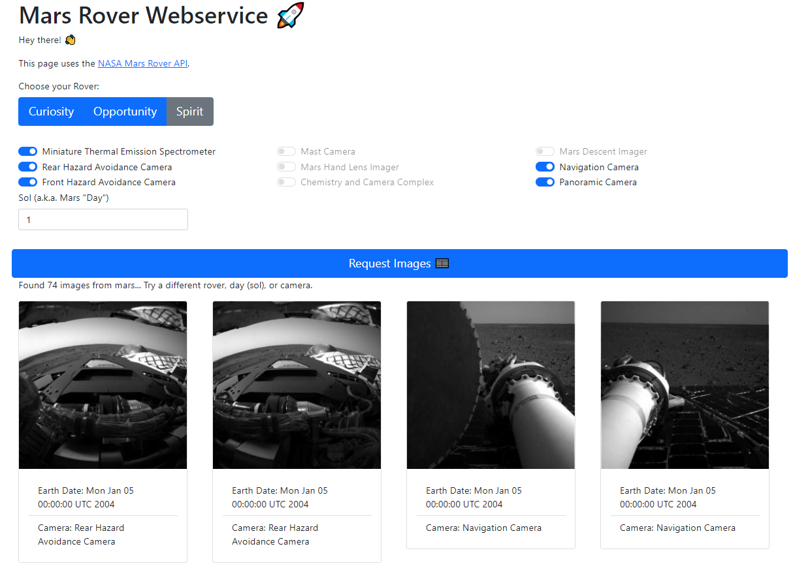

# MarsRoverAPI 🚀

## What?
Visualizes the [NASA Mars Rover API](https://api.nasa.gov/) in a little webservice.

Discover the NASA images from the mars explorations. You can choose...
* one of three different mars rovers 
  * Curiosity
  * Opportunity 
  * Spirit
* multiple different cameras, e.g.
  * Navigation Camera
  * Panoramic Camera
  * Front Hazard Avoidance Camera
  * ...
* a specific day (sol = mars days) since the mars landing 

#### Technology Stack

* [Maven](https://maven.apache.org/) for the project dependency management.
* [Spring Boot](https://spring.io/projects/spring-boot) for the back-end and communication to the NASA API.
* [Thymeleaf](https://www.thymeleaf.org/) to create the HTML templates via Java on the server-side.
* [Bootstrap](https://getbootstrap.com/) for a fancy look.
* [Heroku](https://www.heroku.com/) for automatic continuous deployment, triggered by repo changes here on GitHub.

- - - - - - - - - - - - - -

## Demo
[**Try it out** 🌎](https://mars-rover-images-nasa.herokuapp.com/)

ℹ _Application might be in idle mode when not used for some time, i.e. visiting the page for the first the might take some seconds._




- - - - - - - - - - - - - -

## Getting Started

* Download (`git clone`) the repository.
* Open `application.yaml` file and replace the API key either with your custom NASA API key or the `DEMO_KEY`, e.g.
  ```
    auth:
      api_key: DEMO_KEY
  ```
* `mvn clean package`
* `mvn spring-boot:run` 
* Open http://localhost:8080/ in your browser
* Discover the images of different mars rovers
